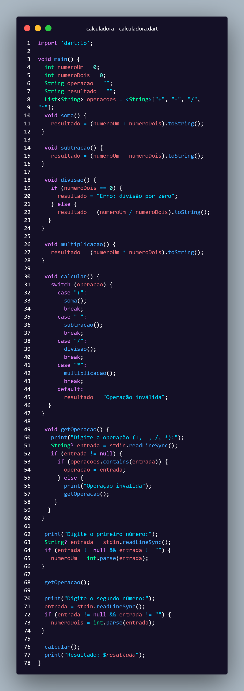

# Calculadora em Dart

Projeto de calculadora desenvolvido durante o curso da Alura.



## Funcionalidades
- [x] Soma
- [x] Subtração
- [x] Multiplicação
- [x] Divisão

## Como executar
```bash
dart run


